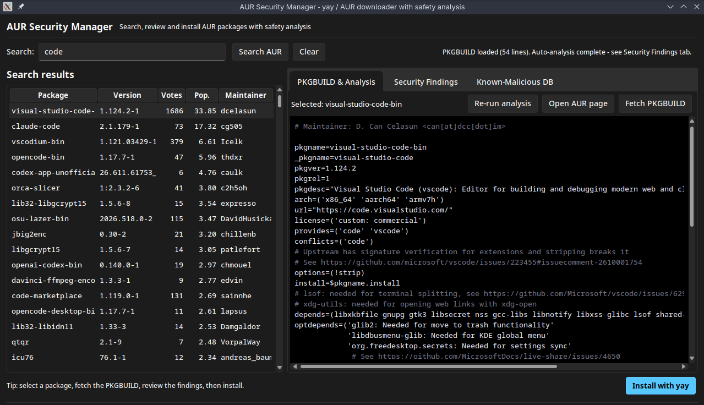
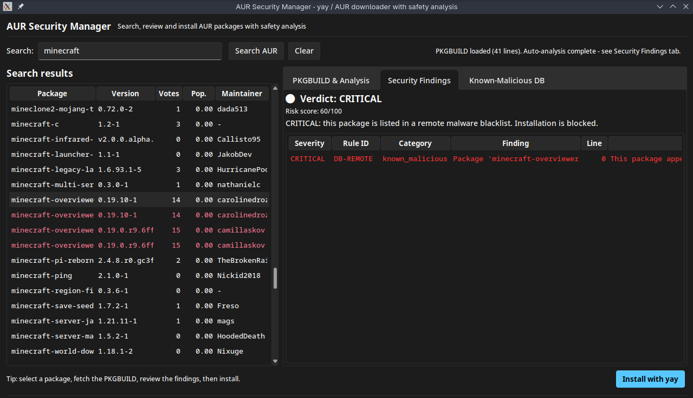

<p align="center">
  
</p>

<h1 align="center">AUR Security Manager</h1>

<p align="center">
  <strong>A Tkinter GUI for yay/AUR with PKGBUILD Security Analysis</strong>
</p>

<p align="center">
  Search, review, and install AUR packages with safety analysis — all from a
  modern desktop interface.
</p>

<p align="center">
  
  
  
</p>

---

## ✨ Features

- **Search the AUR** — Query the official AUR RPC API by package name.
- **PKGBUILD Viewer** — Fetch and display any package's PKGBUILD with syntax-friendly styling.
- **Security Analysis** — Scan PKGBUILDs for dangerous patterns:
  - Destructive commands (`rm -rf /`, `dd if=...`, `mkfs`, etc.)
  - Remote code execution / pipe-to-shell
  - Obfuscation, base64, and encoded payloads
  - Persistence mechanisms (systemd services, cron, sshd)
  - Network exfiltration
  - Cryptominer signatures
  - Reverse shells
  - Setuid binaries
  - Typosquatting detection
- **Safety Gate** — Installation is blocked for critical-severity packages; high-severity requires explicit risk acceptance.
- **Malware Blacklist** — Cross-references packages against a curated database of historically malicious AUR packages with severity, reason, and incident date.
- **Remote Blacklist Sync** — Fetches live malware blocklists from remote URLs on startup.
- **Terminal Install Window** — Runs `yay -S` in a real-time terminal-like popup with coloured output.
- **Install Cancellation** — Cancel an in-progress installation at any time.

## 🖼️ Screenshots

<p align="center">
  
</p>

<p align="center">
  
</p>

## 📦 Requirements

- **Python 3.8+** (stdlib only: `tkinter`, `urllib`, `json`, `re`, `subprocess`, `threading`)
- [`yay`](https://github.com/Jguer/yay) — AUR helper (must be installed and on `PATH` for installation)
- [`pacman`](https://archlinux.org/pacman/) — Arch Linux package manager

### Python packages (optional — improves appearance)

| Package | Purpose | Installation |
|---------|---------|-------------|
| [`sv_ttk`](https://pypi.org/project/sv-ttk/) | Sun Valley theme for a modern look | `pip install sv-ttk` |
| [`darkdetect`](https://pypi.org/project/darkdetect/) | Automatic dark mode detection | `pip install darkdetect` |
| [`pywinstyles`](https://pypi.org/project/pywinstyles/) | Dark title bar on Windows 10/11 | `pip install pywinstyles` |

## 🚀 Usage

### Installation

```bash
# Clone the repo
git clone https://github.com/MedAmine-Bahassou/yay-manager.git
cd yay-manager

# (Recommended) Create a virtual environment
python -m venv venv
source venv/bin/activate

# Install dependencies
pip install -r requirements.txt
```

### Running

```bash
python aur_security_manager.py
```

### Workflow

#### 1. 🔍 Search for a package

Type a package name into the search bar and click **Search AUR** (or press <kbd>Enter</kbd>).
Results appear in a table showing name, version, description, and maintainer.

> **Tip:** Use partial or full package names. The search queries the official AUR RPC API.

#### 2. 📄 Review the PKGBUILD

Select a package from the results and click **Fetch PKGBUILD**.
The raw PKGBUILD is displayed in a monospace viewer with syntax-friendly colours.

#### 3. 🛡️ Run security analysis

Click **Analyse** to scan the PKGBUILD against the danger formula engine.
Switch to the **Security Findings** tab to see:

- Each detected pattern with a severity badge (info / low / medium / high / critical)
- The exact line number where the pattern was found
- A detailed description of the risk
- Historical malware references when applicable

#### 4. ⚠️ Understand the verdict

The analyser computes a risk score (0–100) and one of four verdicts:

| Verdict | Meaning |
|---------|---------|
| 🟢 Safe | No significant issues detected |
| 🟡 Caution | Minor concerns — review before installing |
| 🟠 Dangerous | High-risk patterns — explicit confirmation required |
| 🔴 Critical | Malicious patterns detected — installation **blocked** |

#### 5. 📦 Install the package

Click **Install with yay** to start the installation.

- **Critical** packages are **blocked** outright — you must install manually if you disagree.
- **Dangerous** packages show an „I accept the risk“ dialog before proceeding.
- **Safe / Caution** packages go straight to a final confirmation.

Once confirmed, a terminal-like popup opens showing real-time `yay` output.
You can **cancel** the installation at any time by clicking the **Cancel** button.

#### 6. ✅ After installation

The window shows a success or failure message. Click **Close** to dismiss it.
The main window status bar also reflects the result.

## 📜 Malware References

The analyser includes a curated database (updated as of July 2024) covering real AUR malware incidents:

- **July 2018** — Cryptominer delivered via `.install` hook (Acidanthera)
- **November 2022** — `post_install` SSH backdoor persistence
- **Discord typo-squats** — Packages mimicking popular Discord clients
- And many more historical incidents with CVE-style entries and mitigation notes

## 🔧 Troubleshooting

| Issue | Solution |
|-------|----------|
| `yay` not found | Install yay: `sudo pacman -S --needed git base-devel && git clone https://aur.archlinux.org/yay.git && cd yay && makepkg -si` |
| Theme doesn't look modern | Install `sv-ttk`: `pip install sv-ttk` |
| Dark title bar not working (Windows) | Install `pywinstyles`: `pip install pywinstyles` |

## 👤 Author

**MedAmine-Bahassou**
